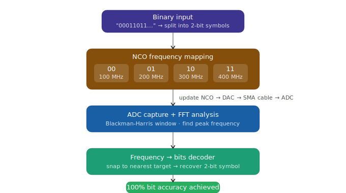

# 04 — FSK Loopback

**Status: ✅ Working — 100% bit accuracy achieved**

---

## Why This Was Needed

Design 03 gave us a working physical loopback — we could send and receive signals in the same Python session. But the signal carried no information. It was just a waveform going in a circle.

The obvious next step: encode actual data into the signal. We chose **4-FSK (Frequency Shift Keying)** as the first modulation scheme because it maps naturally onto the hardware we already had. The RFDC has a built-in NCO (Numerically Controlled Oscillator) that can change the DAC's output frequency under software control. Instead of moving data through a hardware modulator, we could simply change the NCO frequency in Python — one frequency per 2-bit symbol — and detect those frequencies on the receive side using FFT.

No new hardware required. The same `dac_adc.bit` bitfile from Design 03 is reused entirely. The modulation and demodulation both happen in software.

**This design successfully transmitted and received binary data with 100% accuracy.**

---

## What This Design Does

A binary sequence is split into 2-bit pairs. Each pair maps to one of four NCO frequencies (100, 200, 300, 400 MHz). For each symbol, Python updates the DAC NCO, triggers an ADC capture, runs FFT on the received samples to detect the dominant frequency, and maps it back to bits.

<p align="center">
  
</p>

---

## Files

| File | Description |
|------|-------------|
| `fsk_dac_adc_bd.tcl` | Vivado block design script (same hardware as Design 03) |
| `fsk_dac_adc_project.tcl` | Full Vivado project restoration script |
| `dac_adc.hwh` | Hardware Handoff — shared with Design 03 |
| `fsk_loopback.ipynb` | PYNQ Jupyter notebook with full FSK TX/RX and BER measurement |

> Note: The hardware (`dac_adc.hwh`, bitfile) is identical to Design 03. The two TCL files are preserved here for completeness and independent rebuild.

---

## Block Design

Hardware is identical to Design 03. Refer to that README for the full IP list and architecture. The only difference is in what the software does with it.

**FSK symbol mapping:**

| 2-bit Symbol | NCO Frequency |
|-------------|--------------|
| `00` | 100 MHz |
| `01` | 200 MHz |
| `10` | 300 MHz |
| `11` | 400 MHz |

---

## How It Works — The Software

**Initialization**
```python
ol = Overlay("dac_adc.bit")
rfdc = xrfdc.RFdc(ol.ip_dict['usp_rf_data_converter_0'])
target_block = rfdc.dac_tiles[0].blocks[0]
dma_send = ol.axi_dma_0.sendchannel
dma_recv = ol.axi_dma_0.recvchannel

input_buffer = allocate(shape=(1024,), dtype=np.uint16)
output_buffer = allocate(shape=(8192,), dtype=np.int16)
```

**NCO update function**
```python
def update_nco(rf_block, nco_freq):
    mixer_cfg = rf_block.MixerSettings
    mixer_cfg['Freq'] = nco_freq
    rf_block.MixerSettings = mixer_cfg
    rf_block.UpdateEvent(xrfdc.EVENT_MIXER)
```

**FFT-based frequency detection**
```python
from scipy.signal import windows

ADC_SAMPLE_RATE_MSPS = 1638.4

def analyze_signal(data):
    centered = data.astype(np.float32) - np.mean(data)
    win = windows.blackmanharris(len(centered))
    fft_res = np.fft.fft(centered * win)
    freqs = np.fft.fftfreq(len(centered), 1 / (ADC_SAMPLE_RATE_MSPS * 1e6))
    pos_freqs = freqs[20:len(freqs)//2] / 1e6       # skip DC bins
    pos_mag = np.abs(fft_res[20:len(fft_res)//2])
    return pos_freqs[np.argmax(pos_mag)]
```

**Full transmission loop**
```python
TARGET_FREQS = [100, 200, 300, 400]
FREQ_TO_BITS = {100: "00", 200: "01", 300: "10", 400: "11"}

# Activate DAC with a DC level (NCO provides the frequency)
input_buffer[:] = 0x7FFF
dma_send.transfer(input_buffer)

for i in range(0, len(sequence), 2):
    pair = sequence[i:i+2]
    freq = {
        "00": 100, "01": 200, "10": 300, "11": 400
    }[pair]

    update_nco(target_block, freq)

    dma_recv.transfer(output_buffer)
    dma_recv.wait()

    detected_f = analyze_signal(output_buffer)
    closest_freq = min(TARGET_FREQS, key=lambda x: abs(x - detected_f))
    decoded_bits = FREQ_TO_BITS[closest_freq]
```

---

## Results

From the notebook output, transmitting the sequence `00011011` repeated 6 times (48 bits total):

```
TX: 00 -> Detected: 100.80 MHz -> RX Bits: 00  ✓
TX: 01 -> Detected: 201.40 MHz -> RX Bits: 01  ✓
TX: 10 -> Detected: 302.40 MHz -> RX Bits: 10  ✓
TX: 11 -> Detected: 397.80 MHz -> RX Bits: 11  ✓
...
Original Sequence: 00011011000110110001101100011011000110110001101100
Decoded  Sequence: 00011011000110110001101100011011000110110001101100
```

**Bit accuracy: 100%** across all 48 bits.

The detected frequencies are slightly offset from the nominal values (e.g., 302.40 instead of 300 MHz) — this is expected due to FFT bin resolution at the given sample rate and buffer size, and doesn't affect decoding since we snap to the nearest target frequency.

A separate timing measurement showed a data rate of approximately **51 bits/second** at this configuration — limited by the Python overhead of the NCO update and DMA capture loop, not by the RF hardware itself.

---

## Known Issues / Notes

- **Pure software modulation:** The NCO update happens in Python over AXI-Lite. This is slow — each symbol requires a register write round-trip. The ~51 bps throughput is fundamentally limited by Python, not by the RF path.
- **Accuracy drops at higher speeds:** When the `time.sleep()` between symbols was removed entirely to maximize speed, accuracy dropped to ~40% (seen in one experiment in the notebook). The ADC capture doesn't have time to see a clean, settled tone before the NCO changes again.
- **What's missing:** FSK works cleanly, but the bottleneck is clear — modulation in software will never be fast. To get real throughput, the modulation logic needs to move into hardware. That's what Design 05 attempts.
