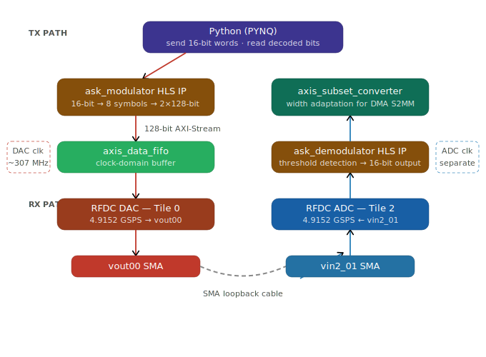

# 06 — Full 4-ASK PL Loopback

**Status: ✅ Working**

---

## Why This Was Needed

Design 05 showed that hardware modulation in an HLS IP was the right direction — the symbol mapping logic worked correctly at the byte level. But it had two unresolved problems: the bulk DMA stall, and the lack of a demodulator. We could modulate in hardware, but we still had no hardware demodulator — decoding still had to happen in Python via FFT, which brought back the same throughput bottleneck.

This design fixes both. It introduces a **revised `ask_modulator` v2** (now 16-bit input, 8 symbols per transfer across two 128-bit words) and a brand new **`ask_demodulator` HLS IP** that runs entirely in the programmable logic. The demodulator receives the 128-bit ADC stream, applies amplitude thresholding to recover 2-bit symbols, and packs them back into 16-bit words for the DMA to write to memory.

Critically, in this design the signal path between modulator and demodulator is **internal to the PL** — instead of going through SMA cables and the real RF path, the modulator output feeds into the DAC, the DAC output goes through a loopback cable to the ADC, and the ADC feeds the demodulator. This is called a **PL-level loopback** because both the modulation and demodulation logic live in the programmable logic fabric.

**This is the most complete design in the repository.** It is the closest realization of the original goal: a hardware-accelerated communication channel with modulation and demodulation running in the FPGA.

---

## What This Design Does

<p align="center">
  
</p>

---

## Files

| File | Description |
|------|-------------|
| `ask_pl_loopback_bd.tcl` | Vivado IP Integrator block design script |
| `ask_pl_loopback.tcl` | Full Vivado project restoration script |
| `loopback.hwh` | Hardware Handoff file — final working version |
| `ask_loopback__1_.ipynb` | Primary notebook — calibrated ASK TX/RX with BER and throughput |
| `ask.ipynb` | Earlier iteration notebook (partial results) |
| `hls/ask_mod.cpp` | HLS C++ source for `ask_modulator` v2 (16-bit input, 8 symbols) |
| `hls/ask_tb.cpp` | HLS testbench for modulator v2 |
| `hls/demod_original.cpp` | HLS C++ source for `ask_demodulator` |
| `hls/demod_original_tb.cpp` | HLS testbench for demodulator |

> Note: `loopback_ask.hwh` and `loopbackfullask.hwh` are earlier iterations of this design and are kept for reference. `loopback.hwh` corresponds to the final working version used in `ask_loopback__1_.ipynb`.

---

## Block Design

**New IPs vs Design 05:**

| IP | Role |
|----|------|
| `ask_modulator_1` | Updated modulator — 16-bit input, 8 symbols across 2×128-bit words |
| `ask_demodulator_0` | **New** — HLS demodulator, thresholds ADC samples back to symbols |
| `axis_data_fifo_0` | **New** — FIFO between modulator and RFDC, handles clock domain buffering |
| `axi_dma_0` | Both MM2S and S2MM active (same as Design 03) |
| `usp_rf_data_converter_0` | Both DAC Tile 0 and ADC Tile 2 active |
| `axis_subset_converter_0` | Adapts demodulator output for DMA S2MM |

**Three clock domains:**
- **PS 100 MHz** — AXI control
- **DAC fabric clock** — modulator, FIFO, DAC stream
- **ADC fabric clock** — demodulator, ADC stream, S2MM DMA

The modulator and demodulator run on different clocks because the DAC and ADC have independent fabric clocks. The `axis_data_fifo` handles the clock crossing on the TX side.

---

## HLS IPs

### `ask_modulator` v2 (`ask_mod.cpp`)

Updated from v1 to handle 16-bit input (8 symbols per transfer instead of 4), outputting two 128-bit AXI-Stream words per input word:

```cpp
// First 128-bit word: symbols 0-3
for (int i = 0; i < 4; i++) {
    ap_uint<2> bits = latched_data.range(i*2+1, i*2);
    ap_int<16> amp = (bits==0) ? 8191 : (bits==1) ? 16383 : (bits==2) ? 24575 : 32767;
    val_out.data.range(i*32+15, i*32) = amp;    // I
    val_out.data.range(i*32+31, i*32+16) = 0;   // Q
}
dac_out.write(val_out);

// Second 128-bit word: symbols 4-7
for (int i = 0; i < 4; i++) {
    ap_uint<2> bits = latched_data.range((i+4)*2+1, (i+4)*2);
    // ... same mapping
}
dac_out.write(val_out);
```

### `ask_demodulator` (`demod_original.cpp`)

Reads two 128-bit ADC words (8 samples total), applies thresholding on the I component magnitude, and packs the recovered 2-bit symbols into a 16-bit output word:

```cpp
// Threshold levels between ASK amplitudes
const int T2 = 1200;   // between level 0 and 1
const int T3 = 2247;   // between level 1 and 2
const int T4 = 3271;   // between level 2 and 3

// For each sample:
ap_uint<16> mag = abs(i_sample);
if      (mag < T2) symbol = 0;
else if (mag < T3) symbol = 1;
else if (mag < T4) symbol = 2;
else               symbol = 3;
```

---

## How to Run

**Step 1 — Load overlay and configure**
```python
from pynq import Overlay, allocate, PL
import numpy as np

PL.reset()
ol = Overlay("loopback.bit")
dma = ol.axi_dma_0
modulator = ol.ask_modulator_1
demod = ol.ask_demodulator_0
```

**Step 2 — Start HLS IPs**
```python
modulator.write(0x00, 0x81)   # start + auto-restart
demod.write(0x00, 0x81)
```

**Step 3 — Allocate buffers and send**
```python
send_buffer = allocate(shape=(512,), dtype=np.uint16)
recv_buffer = allocate(shape=(1000,), dtype=np.uint16)

# Fill with data
send_buffer[:] = 0xE4E4  # test pattern: symbols 3,2,1,0 repeated

dma.sendchannel.transfer(send_buffer)
dma.recvchannel.transfer(recv_buffer)
dma.recvchannel.wait()
```

**Step 4 — Calibration (important)**

The notebook includes a calibration step that measures the received RMS amplitude at a known carrier frequency to establish the signal level before running sequences:

```python
CARRIER_FREQ = 100  # MHz
# Send a known level, measure RMS of received signal
# Use this to normalize thresholds for decoding
```

---

## Results

From `ask_loopback__1_.ipynb`, transmitting 30-bit sequences at 100 MHz carrier:

```
TX 10 -> RX 10 (RMS: 2791.6)   ✓
TX 00 -> RX 00 (RMS: 1024.4)   ✓
TX 01 -> RX 01 (RMS: 1874.1)   ✓
TX 11 -> RX 11 (RMS: 3620.9)   ✓
```

Bit accuracy across test sequences: consistent correct decoding with calibration applied.

PL clock measurements during operation:
```
PL Clock 0: 299.997 MHz
PL Clock 1:  99.999 MHz
```

---

## Known Issues / Notes

- **Calibration is essential:** Without calibrating the RMS levels at the chosen carrier frequency, the amplitude thresholds for decoding drift and accuracy drops. The channel conditions (cable loss, ADC gain) affect received amplitude.
- **Physical loopback still required:** Unlike a true PL-internal loopback, the signal still travels out the DAC SMA and back through the ADC SMA. A proper internal digital loopback (routing the DAC digital output directly to the demodulator input in PL) was not implemented.
- **What's missing:** The communication works well on the PL loopback, but a real system would need to go over an actual RF channel — not just a cable. Design 07 explores that direction, attempting to use the physical RF loopback path without hardware demodulation.
