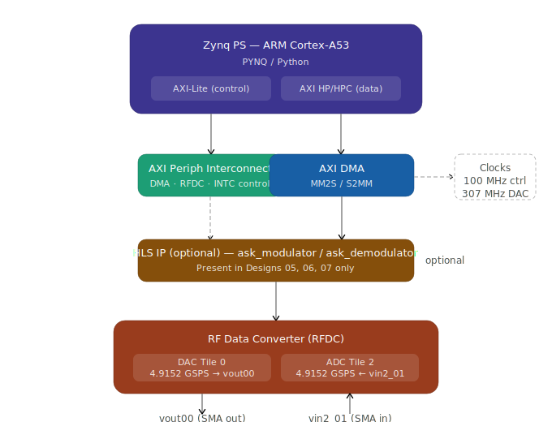

# RFSoC_Communication

This repository is the culmination of a month-long research internship at **IIT Dharwad**, carried out under the guidance of **Prof. Ameer Mulla**.

The task assigned to us was to establish a high-speed communication channel between the ADC and DAC tiles present on the **RFSoC 4x2** board, with some form of digital modulation. What started as figuring out how to simply turn the DAC on evolved — step by step — into a working 4-ASK modulation system with custom HLS IPs running entirely in the programmable logic.

This repository documents that entire journey, including the designs that didn't work.

---

## Team

- Aryan Kadam
- Sujal Jaju
- Harsh Jaiswal

**Supervisor:** Prof. Ameer Mulla, IIT Dharwad
**Duration:** December 2024

---

## Board & Tools

| Item | Details |
|------|---------|
| Board | RFSoC 4x2 (Real Digital) |
| SoC | Xilinx Zynq UltraScale+ xczu48dr-ffvg1517-2-e |
| Vivado | 2022.1 |
| PYNQ | 3.x (Python 3.10) |
| DAC Sampling Rate | 4.9152 GSPS (Tile 0, Slice 0) |
| ADC Sampling Rate | 4.9152 GSPS (Tile 2, Slice 1) |
| DAC Ref Clock | 491.52 MHz (LMX2594) |
| LMK Ref Clock | 245.76 MHz (LMK04828) |

---

## The Journey — From Basic to Complete

Each design in this repo builds directly on the previous one. The progression is intentional: every step was motivated by a limitation of the last.

| # | Design | What It Solves | Status |
|---|--------|----------------|--------|
| 1 | `dma_dac` | Can we produce an analog signal from Python at all? | Working |
| 2 | `adc_dma` | Can we capture an RF signal back into Python? | Working |
| 3 | `dac_adc_loopback` | Can TX and RX work together in one design? | Working |
| 4 | `fsk_loopback` | Can we encode data into frequency and decode it? | Working — 100% accuracy |
| 5 | `dma_dac_ask_modulated` | Can we do ASK modulation in hardware (HLS)? | Partial — TX works, bulk DMA stalls |
| 6 | `ask_pl_loopback` | Can the full ASK mod+demod pipeline run in PL? | Working |
| 7 | `ask_dac_adc` | Can we do ASK over a physical RF loopback? | Experimental |
| 8 | `fifo_dac_adc` | Can FIFOs resolve the clock-domain issues? | Did not produce results |

---

## Repository Structure

```
RFSoC_Communication/
├── README.md
├── 01_dma_dac/                   # DAC output — the starting point
├── 02_adc_dma/                   # ADC capture — the receive side
├── 03_dac_adc_loopback/          # DAC and ADC active in one design
├── 04_fsk_loopback/              # FSK modulation over physical loopback
├── 05_dma_dac_ask_modulated/     # 4-ASK TX with HLS modulator IP
│   └── hls/                      # C++ HLS source: ask_modulator v1
├── 06_ask_pl_loopback/           # Full 4-ASK TX+RX in programmable logic
│   └── hls/                      # C++ HLS source: ask_modulator v2 + ask_demodulator
├── 07_ask_dac_adc/               # ASK over physical RF loopback (experimental)
└── 08_fifo_dac_adc/              # FIFO-buffered loopback attempt (did not work)
```

---

## How to Rebuild a Design

Bitfiles are not included in this repo (they exceed GitHub's file size limit). Every design can be rebuilt from its TCL scripts in **Vivado 2022.1**:

```tcl
# In the Vivado 2022.1 Tcl Console:
source <design_name>_project.tcl    # Restores the full project
# Then: Flow → Generate Bitstream
```

To inspect or modify the block design before generating:
```tcl
source <design_name>_bd.tcl         # Recreates just the block design
```

> ⚠️ Scripts were generated in Vivado 2022.1. Running them in a different version will show a version mismatch warning. Use `Tools → Report → Report IP Status` to upgrade flagged IPs before proceeding.

---

## HLS Custom IPs

Two custom IPs were written in Vivado HLS C++ and packaged as reusable IP cores:

| IP | Used In | What It Does |
|----|---------|--------------|
| `ask_modulator` v1 | Design 05 | 8-bit DMA input → 4 amplitude-mapped symbols → 128-bit AXI-Stream |
| `ask_modulator` v2 | Design 06 | 16-bit DMA input → 8 symbols across 2 × 128-bit words |
| `ask_demodulator` | Design 06 | 128-bit ADC stream → threshold detection → 16-bit packed output to DMA |

---

## Common Hardware Architecture

All designs share this fundamental structure. What changes between them is which paths are enabled and what processing sits between the DMA and the RFDC:

<p align="center">
  
</p>

---

## Clocking

All designs use the RFSoC 4x2 default reference clocks, configured at the start of every notebook:

```python
import xrfclk
xrfclk.set_ref_clks(lmk_freq=245.76, lmx_freq=491.52)
```

Using non-default frequencies requires generating clock config files via [TICS Pro](https://www.ti.com/tool/TICSPRO-SW) and placing them in the `xrfclk` package directory on the board.

---

## References

- [PYNQ DMA Tutorial — Part 1: Hardware Design](https://discuss.pynq.io/t/tutorial-pynq-dma-part-1-hardware-design/3133)
- [Repeating Signal from DMA to DAC — PYNQ Forum](https://discuss.pynq.io/t/repeating-signal-from-dma-to-dac/7485)
- [Vivado ILA Design Tutorial](https://discuss.pynq.io/t/designing-an-overlay-using-vivado-integrated-logic-analyzer-ila-part-1/7155)
- Sagar's *RFSoC 4x2 PL-DMA-DAC Design* document
